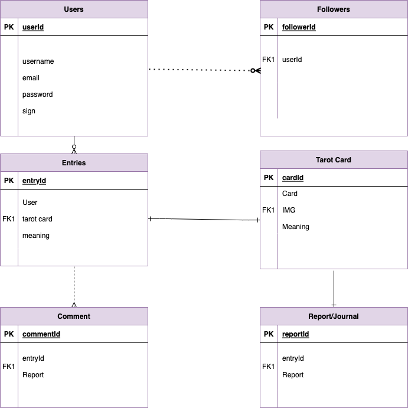
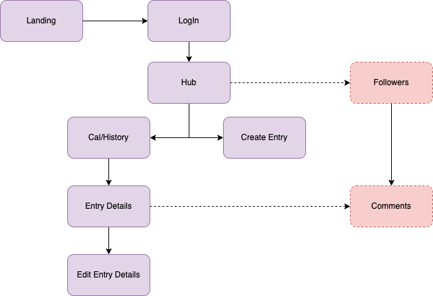
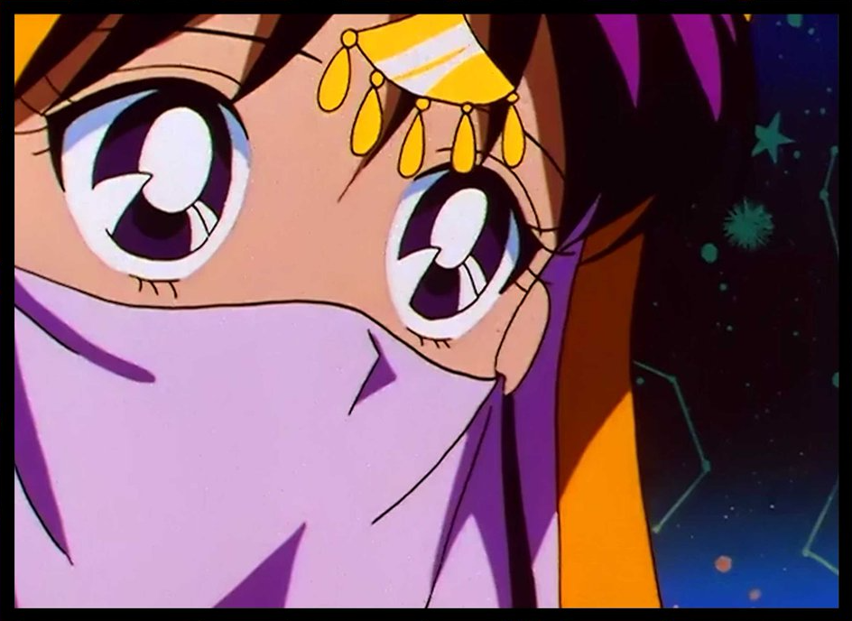
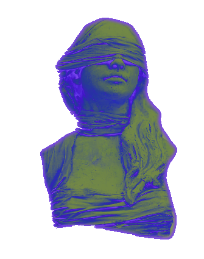

# Project: fortuna
## By: Andres Bolivar | 08/01/2022
[Instagram](http://www.instagram.com/dredose) | [LinkedIn](http://www.linkedin.com/in/drebolivar) | [Github](http://www.github.com/drebolivar) |
===
## Description
 A place to log and share daily tarot card readings.

---
# Technologies Used
- CSS
- HTML
- Javascript
- Express
- NodeJS
- Postgres/Django
- React/Vue

---

# Resources

- [GitHub](https://github.com/drebolivar/fortuna)
- [Trello](https://trello.com/b/2tMKDJpv/fortuna)

---

# Task Lists
- [x] Finalize Name
- [x] Create Trello Board
- [x] Commit GitHub repository
- [ ] Create assets
- [ ] Tarot Database
- [ ] Determine Aesthetic
- [ ] deploy
- [ ] ERD
- [ ] EHD

# Stretch Goals

- [ ] Profile Pages
- [ ] Aesthetic Switches
- [ ] Auth

---
# Entity Relationship Diagram

# Component Heirarchy Diagram\

# Screenshots

---
